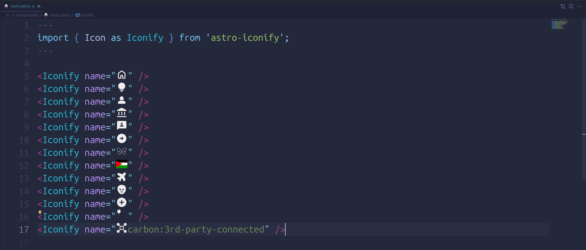
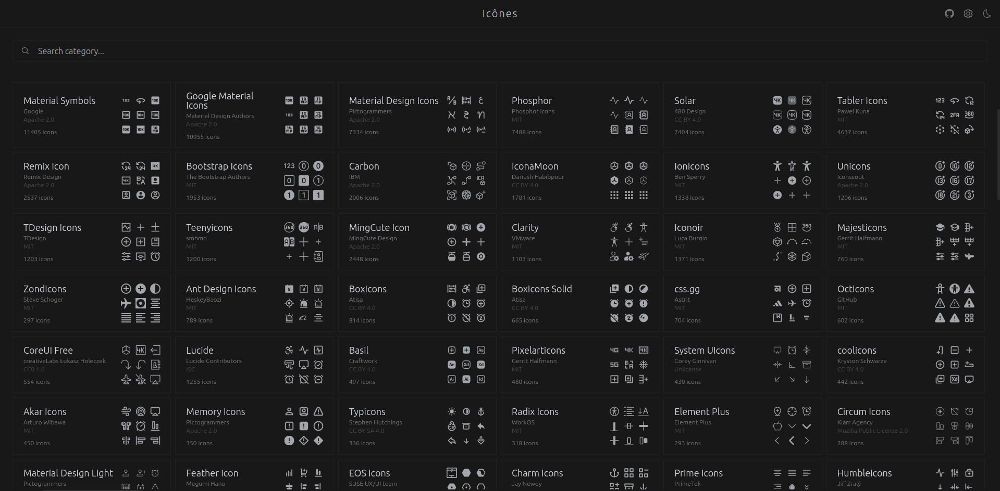

Icons play a vital role in the web development. They guide us, convey messages, and enhance user experiences on numerous websites and applications. Whether you are an experienced developer or a beginner in web development, having a reliable source of high-quality icons is essential. This is where [Iconify](https://iconify.design/) comes in, providing an extensive selection of icons that will breathe life into your projects.

### Understanding Iconify

Iconify is a comprehensive icon library featuring over 150,000 icons and access to over 115 icon sets. It simplifies the process of integrating icons into web development projects, offering a seamless way to choose, customize, and use icons effectively.

### The Iconify Features

#### Diverse Icon Collection

Iconify showcases an extensive collection of icons that span various categories and styles. Whether you're in need of simplistic and minimalistic icons or intricate and detailed ones, Iconify has got you covered.

#### Seamless Integration

With Iconify, integrating icons becomes effortless. Developers can effortlessly incorporate icons into their projects through straightforward API calls or by utilizing specific libraries that are compatible with popular frameworks and platforms.

#### Customization Flexibility

Iconify offers effortless customization options for icons, allowing you to tailor them to suit your project's aesthetic. You have the ability to adjust attributes such as size, color, and more, ensuring that the icons seamlessly blend with your design.

#### Optimal Performance

The lightweight nature of Iconify icons ensures swift loading times, without compromising page speed or overall performance.

#### Compatibility Across Frameworks

Iconify seamlessly integrates with a wide range of frameworks, libraries, and platforms. Whether you're utilizing Svelte, Vue.js, Qwik, React, Tailwind, or UnoCSS, the process of integrating icons remains straightforward.

#### VSCode Extension

Enhance your development workflow with Iconify's VSCode extension, which provides a convenient icon preview directly within the VSCode interface.

#### Search Utility

Effortlessly locate the icons you require by utilizing Iconify's user-friendly [search feature](https://icones.js.org/). Simplify your workflow and save the time spent on selecting icons.

### Elevate Your Projects with Iconify

Incorporating icons into your web projects has never been easier, thanks to Iconify. With its vast collection and seamless integration, you can effortlessly enhance your project's visual appeal and user experience.

Embrace the power of icons and unlock a world of creative possibilities with Iconify. Streamline your development process and leave a lasting impression on your audience.

These features are just the tip of the iceberg. To explore the complete set of features, you can start by visiting the [Iconify documentation site](https://iconify.design/getting-started/).
