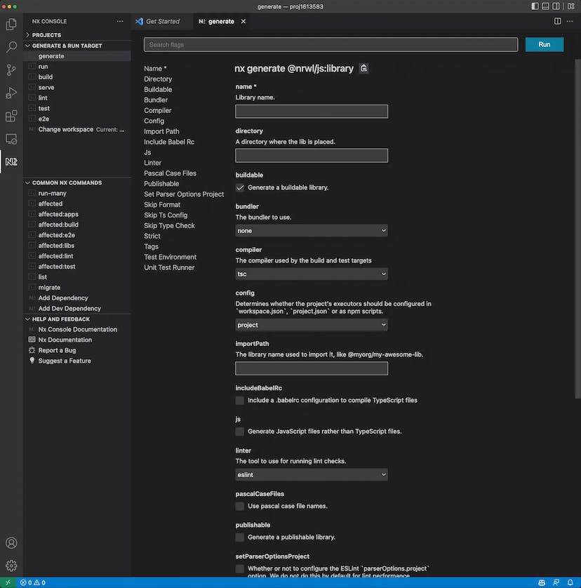
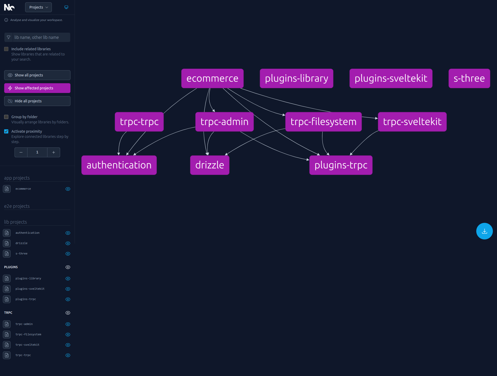
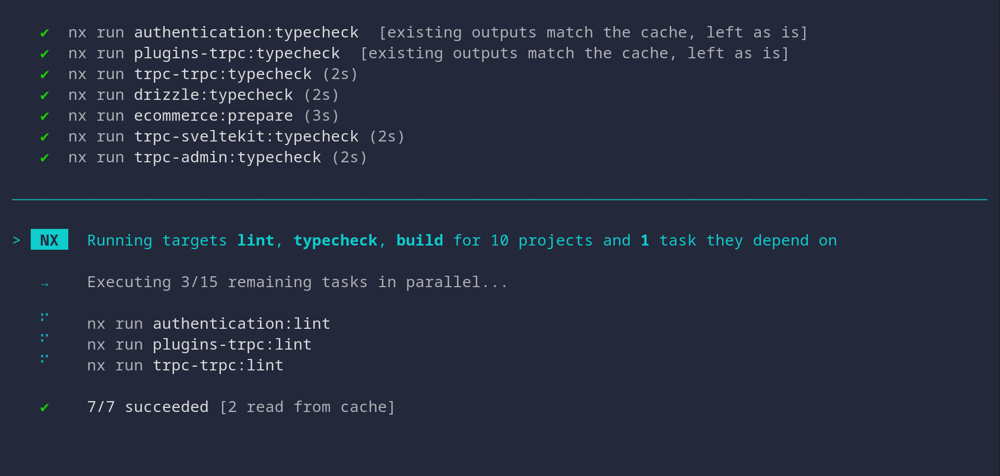
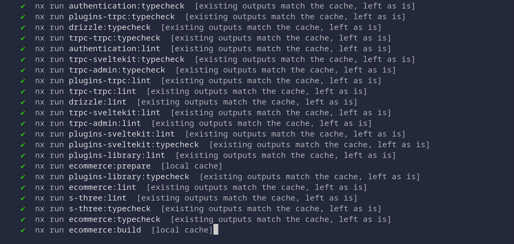
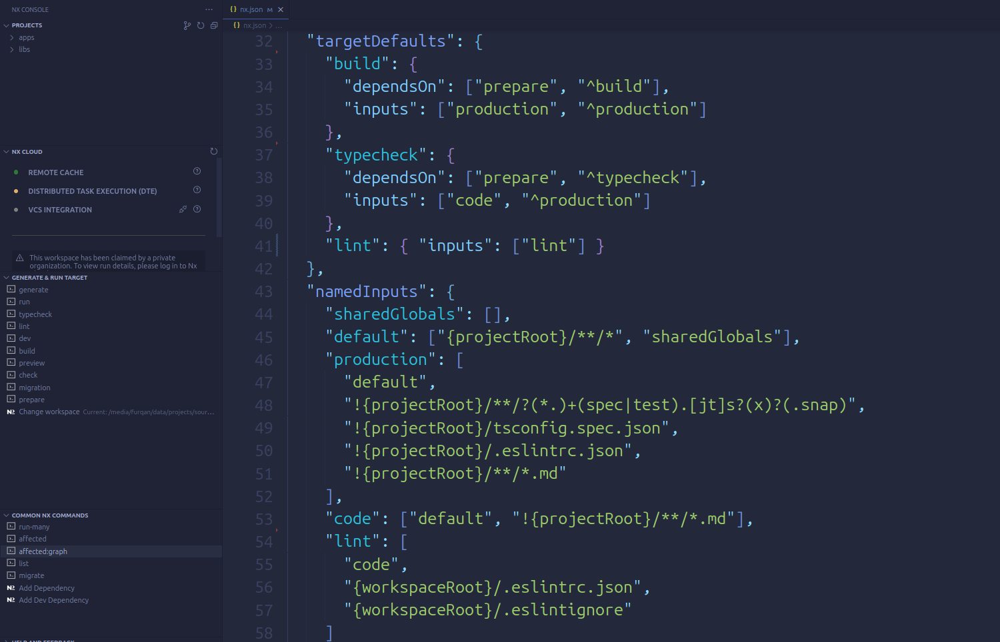

In my most recent article, I explored the concept of monorepo and suggested pnpm, yarn, and npm as good options for managing them. However, these tools might not be the perfect fit for everyone's needs. That's where [Nx](https://nx.dev/) comes in. Nx is a powerful tool specifically designed to streamline monorepo management. From reducing development and CI/CD time to promoting scalability and reusability, Nx is a game-changer. In this blog post, we will take a closer look at Nx, highlighting its key features and demonstrating how it can greatly improve your projects.

### Understanding Nx: An Overview

Nx is a toolkit that is open-source and has been created to assist developers in constructing monorepos that have the ability to scale. It leverages modern development tools and practices to provide an efficient workflow for large-scale applications. Nx offers capabilities for developing multiple applications, libraries, and APIs within a single monorepo.

### Key Features of Nx

#### 1. Monorepo Approach

Nx follows the monorepo architecture, allowing developers to manage multiple projects within a single repository. This approach enhances code sharing, simplifies dependency management, and facilitates efficient collaboration across teams.

#### 2. Code Generation

Nx offers a remarkable feature - its efficient code generation capabilities using plugin. This functionality enables developers to easily create essential elements such as components, services, modules, and more. It ensures adherence to best practices and project-specific guidelines, simplifying and speeding up the development process. As a result, codebases have a consistent and organized architecture right from the beginning. The strength of Nx lies in its automation and optimization of code creation, allowing teams to concentrate on building applications instead of getting caught up in repetitive and time-consuming setup tasks.



#### 3. Dependency Graph

Nx provides a user-friendly and thorough display of the project's dependency graph, showcasing a visual portrayal of the complex links and interconnections among different elements within the codebase. This functionality improves comprehension and examination of the code structure, assisting developers in effectively handling dependencies and optimizing the development procedure.



#### 4. Parallel Task Execution

Nx utilizes parallel task execution to enhance the efficiency of workflows. It cleverly arranges and performs tasks simultaneously, taking into account their interdependencies. This method significantly accelerates the development pace, guaranteeing smooth task management, and ultimately saving considerable time for both developers and the CI/CD process.



#### 5. Never rerun tasks twice

Nx incorporates a smart system that strategically employs caching to prevent unnecessary repetition of tasks. Processes like building and conducting linting checks are never never rerun twice. Nx identifies that there have been no changes in the project's files. As a result, it retrieves files and terminal outputs from its cache. Moreover, it extends caching to remote repositories, facilitating distribution across multiple machines. This methodology leads to substantial time savings for developers and the CI/CD pipeline.



#### 6. Fine-Tuning Task Execution

Nx enables you to specify the circumstances under which the cache for that task should be invalidated and the task should be executed again. For instance, you can instruct the nx to be rebuilt the project only if there are modifications in files with the extensions js, ts, or json. Alternatively, you can define the project to be rebuilt whenever any file changes, except for files with the extensions md, test.ts, or test.js.



### How to integrate Nx into current project

Regardless of whether your project is a monorepo or not, you can utilize features 4, 5, and 6. Simply install the nx package from the npm registry and run the following command:

```bash
npx nx init
```

This is precisely what I implemented in my portfolio project. Feel free to check it out [here](https://github.com/furqanramzan/portfolio).

### Conclusion

Nx emerges as a transformative toolkit for developers navigating the complexities of monorepo management. By significantly reducing development and CI/CD time, promoting scalability, and enhancing reusability, Nx proves to be a vital asset for modern development workflows. Ready to explore the capabilities of Nx? Head over to the [Nx documentation](https://nx.dev/getting-started/intro) and get started on revolutionizing your projects.
